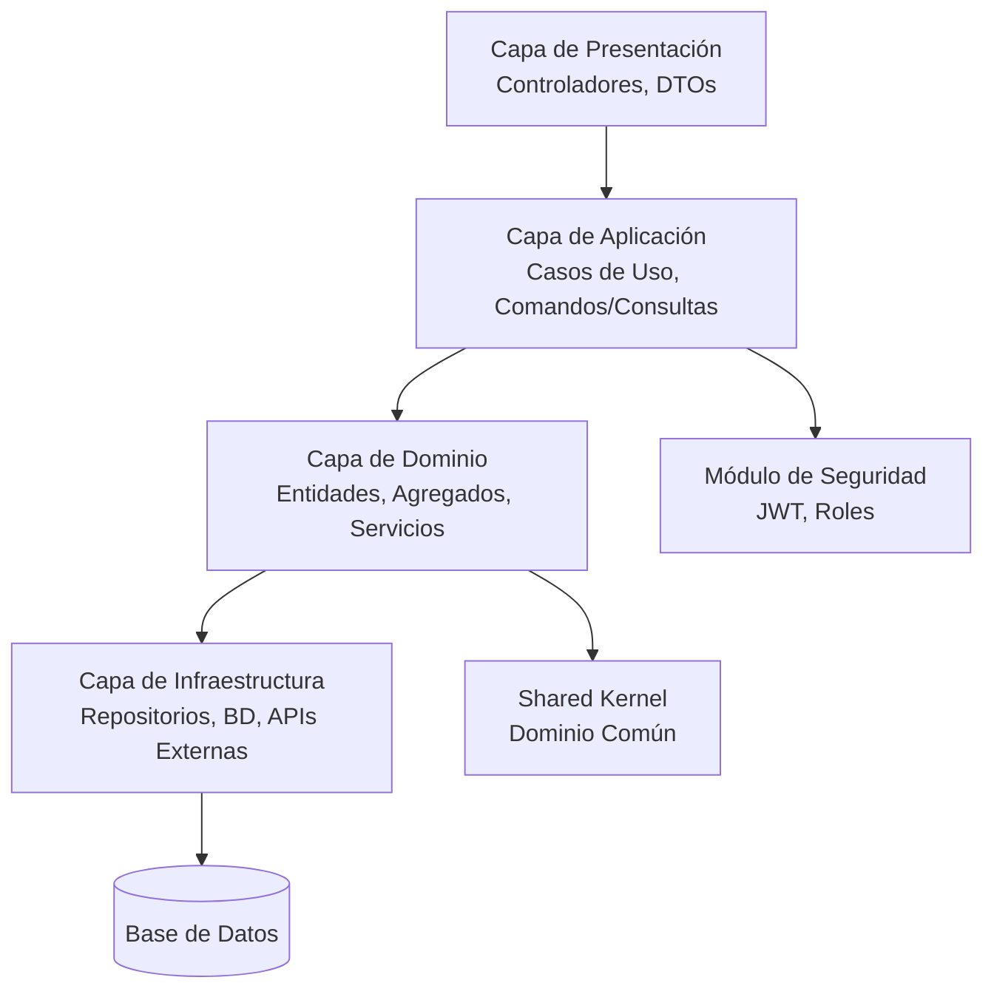

# Arquitectura Backend – Microfarma Horarios

## Principios de Diseño
- Arquitectura N-Capas
- Módulos por contexto de negocio
- Alta cohesión y bajo acoplamiento
- Dominio independiente de frameworks
- Seguridad con JWT desacoplada

## Capas
- **Presentación**: Controladores REST, DTOs, Manejadores de Excepciones, Documentación de API
- **Aplicación**: Servicios de Aplicación (Casos de Uso), Comandos/Consultas, Manejadores de Eventos
- **Dominio**: Entidades, Objetos de Valor, Agregados, Servicios de Dominio, Interfaces de Repositorios, Eventos de Dominio
- **Infraestructura**: Implementaciones de Repositorios, Integraciones Externas, Migraciones de Base de Datos, Configuración

## Módulos

### Organización
- Empresa
- Sede

### Talento Humano
- Empleado
- Cargo
- TipoContrato
- EmpleadoSede

### Horarios (Core)
- Turno
- TipoTurno
- Calendario

### Novedades
- Novedad
- TipoNovedad

### Seguridad (JWT)
- Usuario
- Rol
- RefreshToken
- (Opcional) Permiso, RolPermiso

## Seguridad JWT
Usuario:
- id, nombre, email, passwordHash, activo, rolId

Rol:
- id, nombre

Permiso:
- id, nombre, descripcion

RolPermiso:
- rolId, permisoId

RefreshToken:
- id, usuarioId, token, fechaExpiracion, revocado

## Roles y Permisos
El sistema implementa Control de Acceso Basado en Roles (RBAC) con los siguientes roles predefinidos:

### ADMIN
- Acceso completo a todos los módulos
- Puede gestionar usuarios, roles y permisos
- Puede ver y editar todos los empleados, turnos, novedades y datos organizacionales
- Permisos: TODOS

### RRHH (Recursos Humanos)
- Puede gestionar empleados, cargos, contratos y sedes
- Puede crear, actualizar y eliminar turnos y novedades
- Puede ver reportes y analíticas
- No puede gestionar usuarios o configuraciones del sistema
- Permisos: EMPLEADO_LEER, EMPLEADO_ESCRIBIR, TURNO_LEER, TURNO_ESCRIBIR, NOVEDAD_LEER, NOVEDAD_ESCRIBIR, SEDE_LEER, SEDE_ESCRIBIR

### EMPLEADO
- Puede ver sus propios turnos y novedades
- Puede actualizar su propio perfil (campos limitados)
- No puede acceder a datos de otros empleados
- Permisos: PROPIO_TURNO_LEER, PROPIA_NOVEDAD_LEER, PROPIO_PERFIL_ACTUALIZAR

Los permisos se aplican en la Capa de Aplicación mediante verificaciones de autorización en los Casos de Uso.
Acciones no autorizadas devuelven 403 Forbidden.
Los filtros se aplican basados en el rol del usuario para restringir la visibilidad de datos.

## Implementación de Autorización
- Usar Spring Security con JWT para autenticación.
- Implementar PermissionEvaluator personalizado para control de acceso granular.
- Anotar Casos de Uso con @PreAuthorize("hasPermission(...)") o anotaciones personalizadas.
- Para ADMIN: hasRole('ADMIN') permite todas las operaciones.
- Para RRHH: hasRole('HR') y permisos específicos para CRUD en empleados, turnos, novedades.
- Para EMPLEADO: hasRole('EMPLOYEE') y userId coincide con el usuario actual para operaciones de lectura únicamente.
- Filtrado de datos: En Servicios de Aplicación, aplicar filtros basados en el rol del usuario (ej. employeeId = currentUser.id para EMPLEADO).
- Endpoints de API: Asegurados con @Secured o seguridad a nivel de método.

## Estructura de Paquetes
com.microfarma.horarios
- organizacion
  - domain
  - application
  - infrastructure
  - presentation
- talento
  - ...
- horarios
  - ...
- novedades
  - ...
- seguridad
  - ...
- shared
  - kernel (objetos de dominio comunes)
  - infrastructure (infra compartida como logging)

## Dependencias
Organizacion ← Talento ← Horarios ← Novedades  
Seguridad ↔ Todos los Módulos  
Shared Kernel ← Todos los Módulos

## Filtros

### ADMIN / RRHH
Turnos:
- sedeId
- empleadoId
- rango fechas
- tipoTurno
- nocturno

Empleados:
- sede
- cargo
- activo

Novedades:
- tipo
- empleado
- rango fechas

### EMPLEADO
- Mis turnos
- Mis novedades

## Reglas
- El empleado solo ve su información
- El backend ignora filtros no permitidos
- Filtros se procesan en Servicios de Aplicación

## Diagrama de Arquitectura

## Consideraciones Adicionales
- Adoptar patrones DDD: Agregados, Objetos de Valor, Eventos de Dominio.
- Implementar CQRS para separación de lectura/escritura.
- Agregar preocupaciones transversales: Logging, Validación, Auditoría.
- Planificar pruebas: Unitarias, de Integración, E2E.
- Escalabilidad: Procesamiento asíncrono, Caché.
- Tecnología: Java/Spring Boot, Docker, CI/CD.
