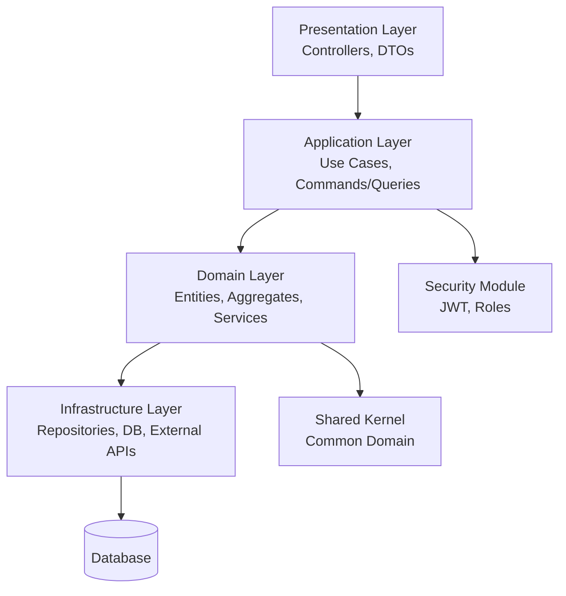

# Backend Architecture – Microfarma Horarios

## Design Principles
- N-Layer Architecture
- Modules by Business Context
- High Cohesion and Low Coupling
- Framework-Independent Domain
- Decoupled JWT Security

## Layers
- **Presentation**: REST Controllers, DTOs, Exception Handlers, API Documentation
- **Application**: Application Services (Use Cases), Commands/Queries, Event Handlers
- **Domain**: Entities, Value Objects, Aggregates, Domain Services, Repository Interfaces, Domain Events
- **Infrastructure**: Repository Implementations, External Integrations, Database Migrations, Configuration

## Modules

### Organization
- Company
- Location

### Human Talent
- Employee
- Position
- ContractType
- EmployeeLocation

### Schedules (Core)
- Shift
- ShiftType
- Calendar

### News
- News
- NewsType

### Security (JWT)
- User
- Role
- RefreshToken
- (Optional) Permission, RolePermission

## Security JWT
User:
- id, name, email, passwordHash, active, roleId

Role:
- id, name

Permission:
- id, name, description

RolePermission:
- roleId, permissionId

RefreshToken:
- id, userId, token, expirationDate, revoked

## Roles and Permissions
The system implements Role-Based Access Control (RBAC) with the following predefined roles:

### ADMIN
- Full access to all modules
- Can manage users, roles, and permissions
- Can view and edit all employees, shifts, news, and organizational data
- Permissions: ALL

### HR (Human Resources)
- Can manage employees, positions, contracts, and locations
- Can create, update, and delete shifts and news
- Can view reports and analytics
- Cannot manage users or system settings
- Permissions: EMPLOYEE_READ, EMPLOYEE_WRITE, SHIFT_READ, SHIFT_WRITE, NEWS_READ, NEWS_WRITE, LOCATION_READ, LOCATION_WRITE

### EMPLOYEE
- Can view their own shifts and news
- Can update their own profile (limited fields)
- Cannot access other employees' data
- Permissions: SELF_SHIFT_READ, SELF_NEWS_READ, SELF_PROFILE_UPDATE

Permissions are enforced at the Application Layer using authorization checks in Use Cases.
Unauthorized actions return 403 Forbidden.
Filters are applied based on user role to restrict data visibility.

## Authorization Implementation
- Use Spring Security with JWT for authentication.
- Implement custom PermissionEvaluator for fine-grained access control.
- Annotate Use Cases with @PreAuthorize("hasPermission(...)") or custom annotations.
- For ADMIN: hasRole('ADMIN') allows all operations.
- For HR: hasRole('HR') and specific permissions for CRUD on employees, shifts, news.
- For EMPLOYEE: hasRole('EMPLOYEE') and userId matches current user for read operations only.
- Data filtering: In Application Services, apply filters based on user role (e.g., employeeId = currentUser.id for EMPLOYEE).
- API Endpoints: Secured with @Secured or method-level security.

## Package Structure
com.microfarma.horarios
- organizacion
  - domain
  - application
  - infrastructure
  - presentation
- talento
  - ...
- horarios
  - ...
- novedades
  - ...
- seguridad
  - ...
- shared
  - kernel (common domain objects)
  - infrastructure (shared infra like logging)

## Dependencies
Organization ← Human Talent ← Schedules ← News  
Security ↔ All Modules  
Shared Kernel ← All Modules

## Filters

### ADMIN / HR
Shifts:
- locationId
- employeeId
- date range
- shiftType
- nightShift

Employees:
- location
- position
- active

News:
- type
- employee
- date range

### EMPLOYEE
- My shifts
- My news

## Rules
- Employee only sees their own information
- Backend ignores unauthorized filters
- Filters processed in Application Services

## Architecture Diagram

## Additional Considerations
- Adopt DDD patterns: Aggregates, Value Objects, Domain Events.
- Implement CQRS for read/write separation.
- Add cross-cutting concerns: Logging, Validation, Auditing.
- Plan for testing: Unit, Integration, E2E.
- Scalability: Asynchronous processing, Caching.
- Technology: Java/Spring Boot, Docker, CI/CD.