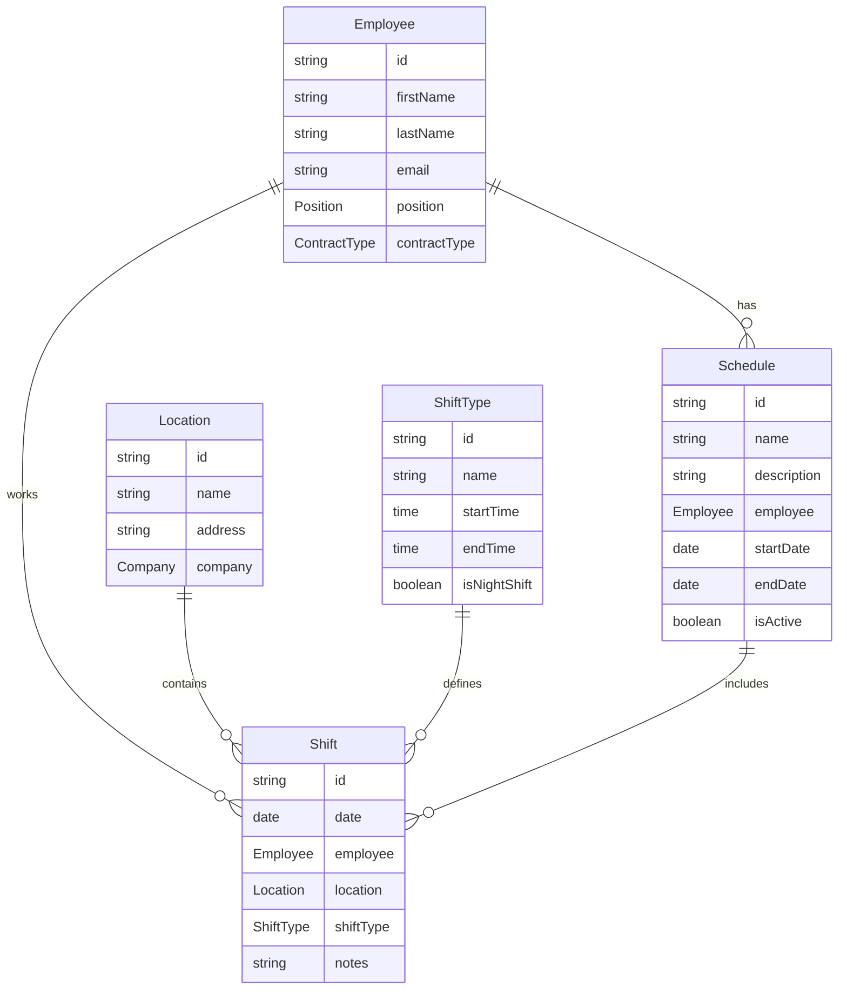
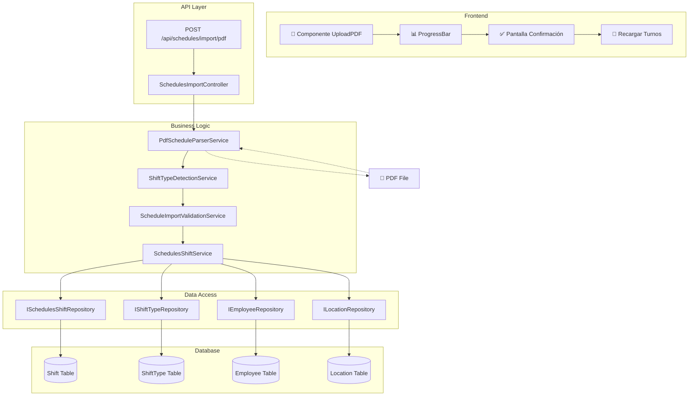
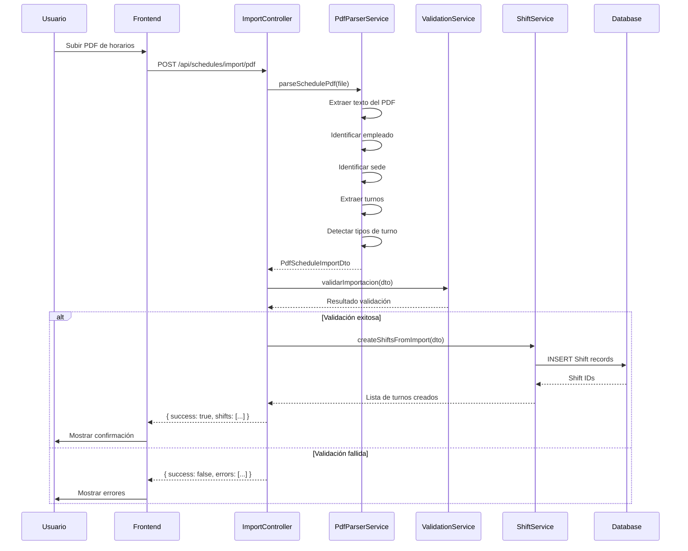

# Plan: Sistema de Importación de Horarios desde PDF

**Fecha:** 6 de Febrero, 2026  
**Proyecto:** Microfarma Horarios  
**Versión:** 1.0

---

## 1. Análisis del Sistema Actual

### 1.1 Estructura de Entidades Existentes

El sistema actual tiene las siguientes entidades principales en el módulo [`Schedules`](Backend/src/main/java/MicrofarmaHorarios/Schedules):



### 1.2 Servicios Existentes Relevantes

#### [`SchedulesShiftService`](Backend/src/main/java/MicrofarmaHorarios/Schedules/Service/SchedulesShiftService.java)
- **`findByDateBetween(startDate, endDate)`**: Obtiene turnos en un rango de fechas
- **`saveAll(shifts)`**: Guarda múltiples turnos (bulk insert)
- **`generateCalendarPdf(year, month, locationId, employeeId)`**: Genera PDF del calendario
- **`generatePersonalShiftsPdf(employeeId)`**: Genera PDF de turnos personales

#### [`SchedulesReportService`](Backend/src/main/java/MicrofarmaHorarios/Schedules/Service/SchedulesReportService.java)
- **`generateReport(month, year)`**: Genera reporte global con estadísticas por empleado y sede
- **`generateReportByLocation(month, year, locationId)`**: Genera reporte por sede específica

### 1.3 Frontend Actual

#### [`Reports.jsx`](Front-End/src/pages/schedules/Reports.jsx)
- Visualización de reportes mensuales
- Filtros por empleado y sede
- Exportación a CSV y PDF
- Resumen global y detalles por empleado/sede

#### [`Shifts.jsx`](Front-End/src/pages/schedules/Shifts.jsx)
- Gestión de turnos (CRUD)
- Vista de tabla y calendario
- Exportación a CSV
- Descarga de PDF por mes y sede

---

## 2. Requisitos del Usuario

### 2.1 Funcionalidades Solicitadas

1. **Importación masiva desde PDF**
   - Subir un PDF con múltiples horarios
   - El sistema debe identificar automáticamente los tipos de turnos
   - Asignar fechas correctas (día/mes/año)
   - Evitar registrar turnos uno por uno

2. **Reportes mejorados**
   - Reporte unificado global
   - Reporte por sede
   - Mantener la visualización actual (que está "muy bonita")

3. **Integridad del sistema**
   - No dañar las funcionalidades existentes
   - Mantener compatibilidad hacia atrás

---

## 3. Formato Propuesto del PDF de Entrada

### 3.1 Estructura del PDF

Para que el sistema pueda parsear el PDF correctamente, se propone el siguiente formato estándar:

```
┌─────────────────────────────────────────────────────────────────────────┐
│                         HORARIO DE TRABAJO                              │
│                         MICROFARMA HORARIOS                              │
├─────────────────────────────────────────────────────────────────────────┤
│  Mes/Año: FEBRERO 2026                                                  │
│  Sede: BOGOTÁ CENTRO                                                   │
├─────────────────────────────────────────────────────────────────────────┤
│                                                                         │
│  EMPLEADO: JUAN PÉREZ GARCÍA                                           │
│  Código: EMP-001                                                        │
│  Cargo: Vendedor                                                        │
│                                                                         │
│  ┌─────────────────────────────────────────────────────────────────┐   │
│  │  LUNES    03/02/2026    08:00 - 16:00    TURNO MAÑANA        │   │
│  │  MARTES   04/02/2026    08:00 - 16:00    TURNO MAÑANA        │   │
│  │  MIÉRCOL  05/02/2026    08:00 - 16:00    TURNO MAÑANA        │   │
│  │  JUEVES   06/02/2026    08:00 - 16:00    TURNO MAÑANA        │   │
│  │  VIERNES  07/02/2026    08:00 - 16:00    TURNO MAÑANA        │   │
│  │  SÁBADO   08/02/2026    09:00 - 13:00    TURNO SÁBADO        │   │
│  │  DOMINGO  09/02/2026    ---------------    LIBRE             │   │
│  └─────────────────────────────────────────────────────────────────┘   │
│                                                                         │
│  Total Horas Semanales: 44 horas                                        │
│                                                                         │
├─────────────────────────────────────────────────────────────────────────┤
│  GENERADO: 01/02/2026 08:00                                            │
└─────────────────────────────────────────────────────────────────────────┘
```

### 3.2 Patrones de Regex para Extracción

```java
// Patrones para extraer datos del PDF
private static final Pattern EMPLOYEE_PATTERN = Pattern.compile(
    "EMPLEADO[:\\s]*([A-Za-zÁÉÍÓÚáéíóú\\s]+)", Pattern.CASE_INSENSITIVE
);
private static final Pattern CODE_PATTERN = Pattern.compile(
    "Código[:\\s]*([A-Z0-9-]+)", Pattern.CASE_INSENSITIVE
);
private static final Pattern DATE_PATTERN = Pattern.compile(
    "(\\d{1,2}/\\d{1,2}/\\d{4})"
);
private static final Pattern SHIFT_PATTERN = Pattern.compile(
    "([A-Za-zÁÉÍÓÚ]+)\\s+(\\d{1,2}/\\d{1,2}/\\d{4})\\s+(\\d{1,2}:\\d{2})\\s*[-–]\\s*(\\d{1,2}:\\d{2})",
    Pattern.CASE_INSENSITIVE
);
private static final Pattern LOCATION_PATTERN = Pattern.compile(
    "Sede[:\\s]*([A-Za-zÁÉÍÓÚ0-9\\s]+)", Pattern.CASE_INSENSITIVE
);
private static final Pattern MONTH_YEAR_PATTERN = Pattern.compile(
    "Mes/Año[:\\s]*([A-Za-z]+)\\s+(\\d{4})", Pattern.CASE_INSENSITIVE
);
```

### 3.3 Mapeo de Turnos

| Turno en PDF | shiftType a Buscar/Crear | Horario |
|--------------|--------------------------|---------|
| TURNO MAÑANA | "Mañana" | 08:00 - 16:00 |
| TURNO TARDE | "Tarde" | 14:00 - 22:00 |
| TURNO NOCHE | "Noche" | 22:00 - 06:00 |
| TURNO SÁBADO | "Sábado Mañana" | 09:00 - 13:00 |
| TURNO DOMINGO | "Domingo" | 08:00 - 16:00 |
| LIBRE | "Descanso" | N/A |

---

## 4. Arquitectura del Sistema de Importación

### 4.1 Diagrama de Arquitectura



### 4.2 Flujo de Importación



---

## 5. Plan de Implementación

### 5.1 Backend - Nuevos Componentes

#### 5.1.1 DTOs de Request

```java
// PdfScheduleImportRequestDto.java
@Data
public class PdfScheduleImportRequestDto {
    private MultipartFile pdfFile;
    private String locationId;  // Opcional: si viene en el PDF
    private Boolean overwriteExisting;  // Por defecto: false
}

// PdfScheduleImportResultDto.java
@Data
public class PdfScheduleImportResultDto {
    private boolean success;
    private String message;
    private int totalShiftsImported;
    private int totalErrors;
    private List<String> errors;
    private List<Shift> importedShifts;
}
```

#### 5.1.2 Servicios

**[`PdfScheduleParserService`](Backend/src/main/java/MicrofarmaHorarios/Schedules/Service/PdfScheduleParserService.java)**
```java
@Service
public class PdfScheduleParserService {
    public PdfScheduleDataDto parsePdf(MultipartFile file) throws IOException;
    private String extractTextFromPdf(PdfDocument pdfDoc);
    private EmployeeInfo extractEmployeeInfo(String text);
    private List<ShiftData> extractShifts(String text, int year, int month);
    private String extractLocation(String text);
}
```

**[`ShiftTypeDetectionService`](Backend/src/main/java/MicrofarmaHorarios/Schedules/Service/ShiftTypeDetectionService.java)**
```java
@Service
public class ShiftTypeDetectionService {
    public ShiftType findOrCreateShiftType(String shiftName, String startTime, String endTime);
    private ShiftType matchByTimeRange(LocalTime start, LocalTime end);
    private ShiftType createNewShiftType(String name, LocalTime start, LocalTime end);
}
```

**[`ScheduleImportValidationService`](Backend/src/main/java/MicrofarmaHorarios/Schedules/Service/ScheduleImportValidationService.java)**
```java
@Service
public class ScheduleImportValidationService {
    public ImportValidationResult validate(PdfScheduleDataDto dto);
    private boolean employeeExists(String employeeCode);
    private boolean locationExists(String locationId);
    private boolean dateRangeValid(LocalDate start, LocalDate end);
}
```

#### 5.1.3 Controlador

```java
@RestController
@RequestMapping("/api/schedules/import")
public class SchedulesImportController {
    
    @PostMapping("/pdf")
    public ResponseEntity<PdfScheduleImportResultDto> importFromPdf(
            @RequestParam("file") MultipartFile file,
            @RequestParam(required = false) String locationId,
            @RequestParam(defaultValue = "false") Boolean overwrite) {
        // Implementación
    }
    
    @PostMapping("/pdf/batch")
    public ResponseEntity<List<PdfScheduleImportResultDto>> importMultiplePdfs(
            @RequestParam("files") MultipartFile[] files) {
        // Implementación
    }
    
    @GetMapping("/pdf/template")
    public ResponseEntity<byte[]> downloadTemplate() {
        // Genera un PDF de ejemplo con el formato correcto
    }
}
```

### 5.2 Frontend - Nuevos Componentes

#### 5.2.1 Servicio de Importación

```javascript
// services/importService.js
class ImportService {
    async importPdf(file, locationId = null, overwrite = false) {
        const formData = new FormData();
        formData.append('file', file);
        if (locationId) formData.append('locationId', locationId);
        formData.append('overwrite', overwrite);
        
        return await apiClient.post('/api/schedules/import/pdf', formData, {
            headers: { 'Content-Type': 'multipart/form-data' }
        });
    }
    
    async importMultiplePdfs(files) {
        const formData = new FormData();
        files.forEach(file => formData.append('files', file));
        return await apiClient.post('/api/schedules/import/pdf/batch', formData);
    }
    
    async downloadTemplate() {
        return await apiClient.get('/api/schedules/import/pdf/template', {
            responseType: 'blob'
        });
    }
}
```

#### 5.2.2 Componente de Upload PDF

```jsx
// pages/schedules/ImportSchedules.jsx
const ImportSchedules = () => {
    const [dragActive, setDragActive] = useState(false);
    const [file, setFile] = useState(null);
    const [importing, setImporting] = useState(false);
    const [result, setResult] = useState(null);
    
    const handleDrop = (e) => {
        e.preventDefault();
        setDragActive(false);
        const droppedFile = e.dataTransfer.files[0];
        if (droppedFile?.type === 'application/pdf') {
            setFile(droppedFile);
        }
    };
    
    const handleImport = async () => {
        setImporting(true);
        try {
            const response = await importService.importPdf(file);
            setResult(response.data);
            await loadShifts(); // Recargar turnos
        } catch (error) {
            setResult({ success: false, errors: [error.message] });
        } finally {
            setImporting(false);
        }
    };
    
    return (
        <div className="space-y-6">
            <h1>Importar Horarios desde PDF</h1>
            
            {/* Área de drag & drop */}
            <div 
                className={`border-2 border-dashed rounded-xl p-8 text-center ${
                    dragActive ? 'border-purple-500 bg-purple-50' : 'border-gray-300'
                }`}
                onDragOver={(e) => { e.preventDefault(); setDragActive(true); }}
                onDragLeave={() => setDragActive(false)}
                onDrop={handleDrop}
            >
                <input 
                    type="file" 
                    accept=".pdf" 
                    onChange={(e) => setFile(e.target.files[0])}
                />
            </div>
            
            {/* Progreso */}
            {importing && <ProgressBar message="Importando horarios..." />}
            
            {/* Resultado */}
            {result && (
                <ImportResultCard 
                    success={result.success}
                    totalImported={result.totalShiftsImported}
                    errors={result.errors}
                />
            )}
            
            <Button onClick={handleImport} disabled={!file || importing}>
                Importar Horarios
            </Button>
        </div>
    );
};
```

### 5.3 Dependencias a Agregar

No se necesitan nuevas dependencias ya que el proyecto ya tiene **iTextPDF** en el [`pom.xml`](Backend/pom.xml:113):

```xml
<dependency>
    <groupId>com.itextpdf</groupId>
    <artifactId>layout</artifactId>
    <version>8.0.2</version>
</dependency>
<dependency>
    <groupId>com.itextpdf</groupId>
    <artifactId>kernel</artifactId>
    <version>8.0.2</version>
</dependency>
```

---

## 6. Pasos de Implementación

### Fase 1: Backend - Parser de PDF
- [ ] Crear `PdfScheduleDataDto`
- [ ] Crear `PdfScheduleParserService` con extracción de texto
- [ ] Implementar regex para extraer empleado, fecha, turnos
- [ ] Crear pruebas unitarias del parser

### Fase 2: Backend - Servicios de Negocio
- [ ] Crear `ShiftTypeDetectionService`
- [ ] Crear `ScheduleImportValidationService`
- [ ] Crear `SchedulesImportController`
- [ ] Endpoint: `POST /api/schedules/import/pdf`
- [ ] Endpoint: `POST /api/schedules/import/pdf/batch`
- [ ] Endpoint: `GET /api/schedules/import/pdf/template`

### Fase 3: Frontend - Componente de Importación
- [ ] Crear `importService.js`
- [ ] Crear página `ImportSchedules.jsx`
- [ ] Implementar drag & drop
- [ ] Implementar progress indicator
- [ ] Implementar pantalla de confirmación

### Fase 4: Integración y Pruebas
- [ ] Probar con PDFs reales
- [ ] Verificar que no rompa funcionalidad existente
- [ ] Probar manejo de errores
- [ ] Documentar el formato del PDF esperado

---

## 7. Formato del PDF de Salida (Reportes)

El sistema ya genera reportes en PDF bonititos. No se necesitan cambios en [`SchedulesShiftService.generateCalendarPdf()`](Backend/src/main/java/MicrofarmaHorarios/Schedules/Service/SchedulesShiftService.java:279) ya que funciona correctamente.

### Reporte Unificado Global
- Ya existe en [`SchedulesReportService.generateReport()`](Backend/src/main/java/MicrofarmaHorarios/Schedules/Service/SchedulesReportService.java:36)
- Muestra todos los empleados de todas las sedes
- Incluye estadísticas globales

### Reporte por Sede
- Ya existe en [`SchedulesReportService.generateReportByLocation()`](Backend/src/main/java/MicrofarmaHorarios/Schedules/Service/SchedulesReportService.java:142)
- Filtra por `locationId`
- [`Reports.jsx`](Front-End/src/pages/schedules/Reports.jsx:189) ya tiene el filtro por sede

---

## 8. Consideraciones de Seguridad

1. **Validación de empleados**: Solo importar turnos para empleados que existan en la BD
2. **Validación de sedes**: Verificar que la sede exista
3. **Validación de tipos de turno**: Crear automáticamente si no existen
4. **Sobreescritura**: Opción para reemplazar turnos existentes o fallar si ya existen
5. **Logging**: Registrar todas las importaciones para auditoría

---

## 9. Manejo de Errores

| Error | Causa | Acción |
|-------|-------|--------|
| Empleado no encontrado | Código de empleado no existe | Error + mostrar código no válido |
| Sede no encontrada | LocationId inválido | Error + pedir seleccionar sede |
| Fecha inválida | Formato de fecha incorrecto | Error + línea con problema |
| Turno duplicado | Ya existe turno para esa fecha | Depende de `overwrite` flag |
| PDF corrupto | No se puede leer | Error + "Archivo no válido" |

---

## 10. Preguntas para el Usuario

1. **Formato del PDF actual**: ¿Tus PDFs actuales tienen un formato similar al propuesto, o necesitamos crear uno desde cero?

2. **Manejo de duplicados**: Si ya existen turnos para las fechas del PDF, ¿querés:
   - a) Sobrescribir los existentes
   - b) Solo agregar los nuevos
   - c) Fallar la importación completa

3. **Frecuencia de importación**: ¿Vas a importar PDFs:
   - a) Mensualmente (1 archivo por mes)
   - b) Semanalmente (4 archivos por mes)
   - c) Por sede (1 archivo por cada sede)

4. **Tipos de turno**: ¿Tenés tipos de turno predefinidos o el sistema debe crearlos automáticamente basándose en los horarios?

---

## 11. Archivos a Modificar/Crear

### Backend
```
Backend/src/main/java/MicrofarmaHorarios/Schedules/
├── Controller/
│   └── SchedulesImportController.java  [NUEVO]
├── DTO/
│   └── Request/
│       ├── PdfScheduleDataDto.java     [NUEVO]
│       └── PdfScheduleImportResultDto.java [NUEVO]
└── Service/
    ├── PdfScheduleParserService.java           [NUEVO]
    ├── ShiftTypeDetectionService.java          [NUEVO]
    └── ScheduleImportValidationService.java    [NUEVO]
```

### Frontend
```
Front-End/src/
├── pages/
│   └── schedules/
│       └── ImportSchedules.jsx        [NUEVO]
└── services/
    └── importService.js               [NUEVO]
```

---

**¿Estás de acuerdo con este plan? ¿Qué ajustes te gustaría hacer antes de comenzar la implementación?**
